# DriverRevenueOptimization
Maximizing driver revenue based on payment method


## Maximizing driver revenue based on payment method


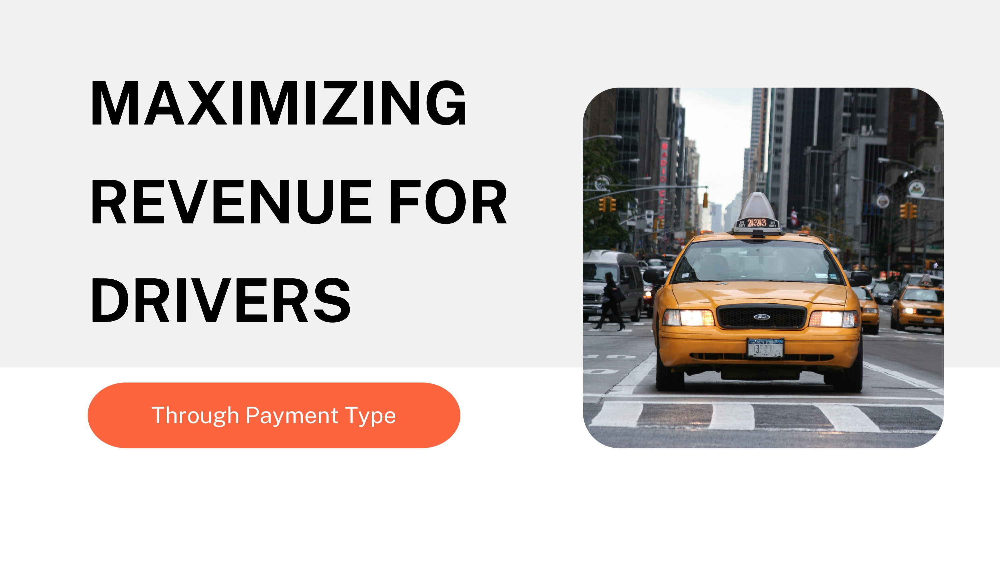
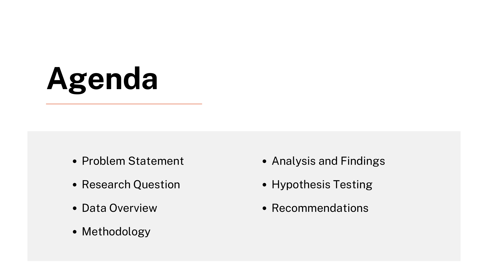
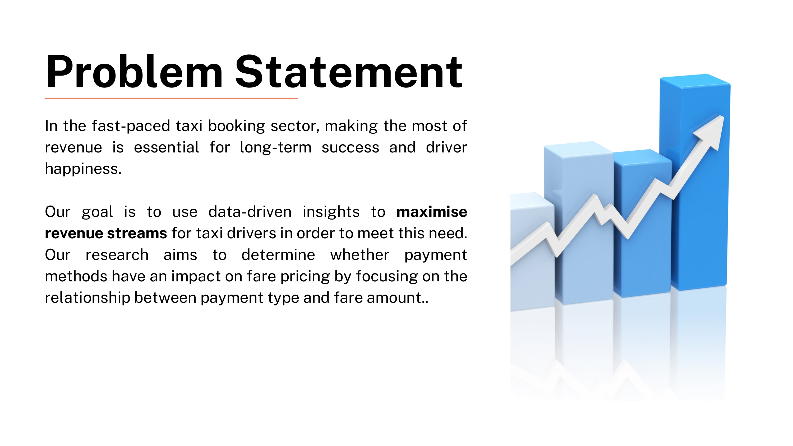
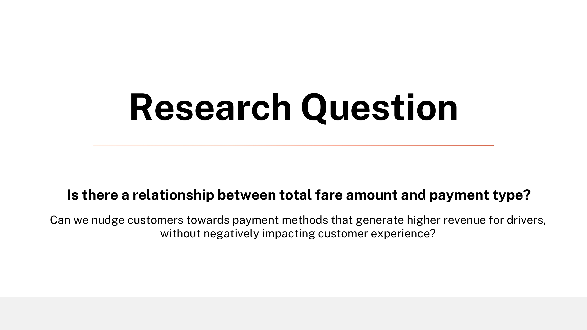
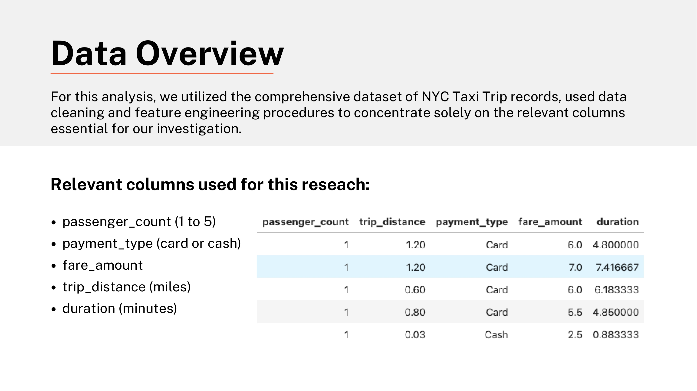
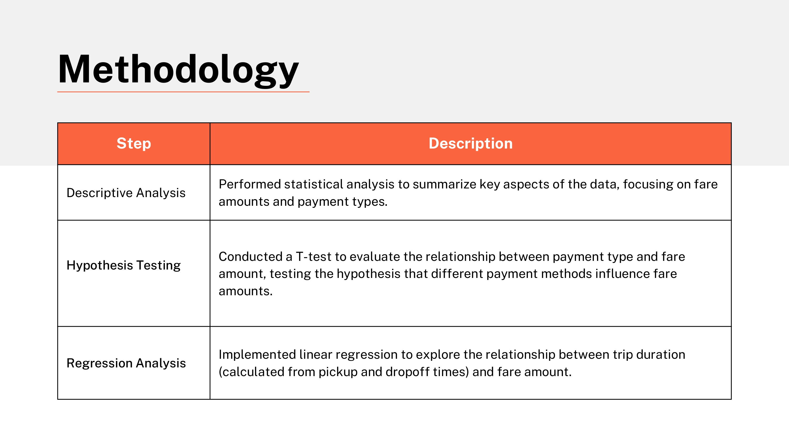
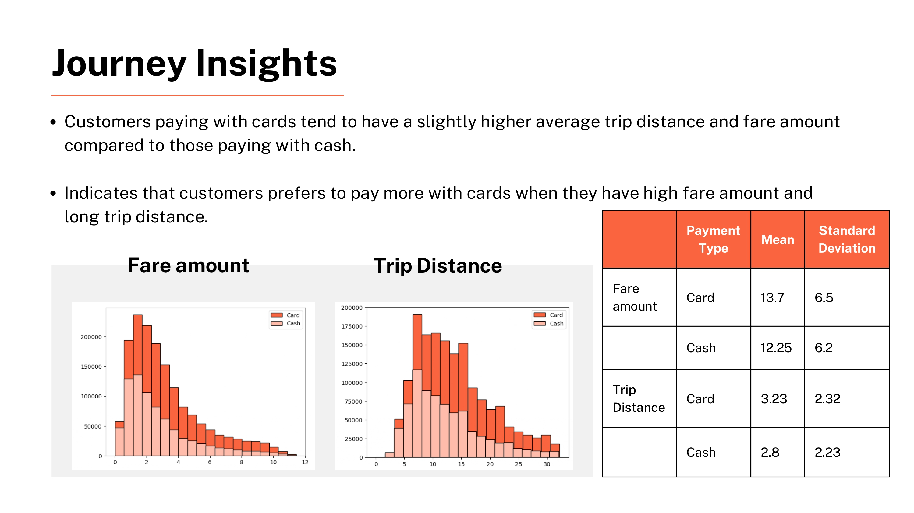
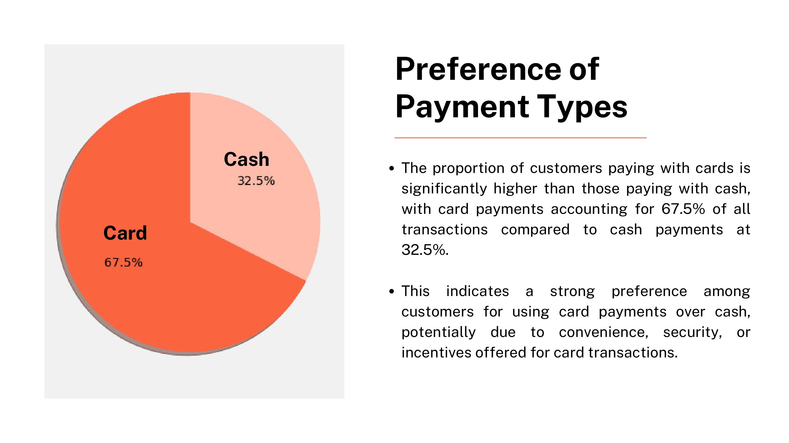
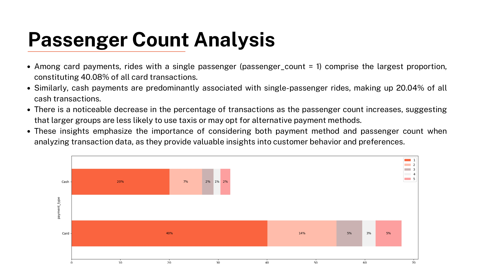
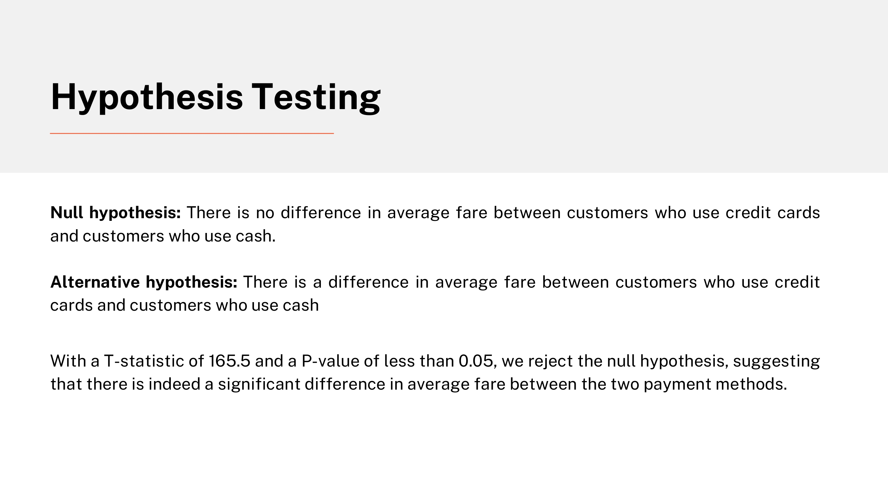
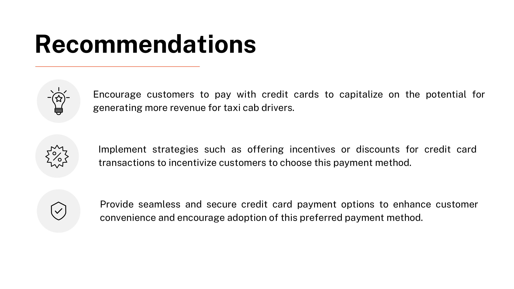
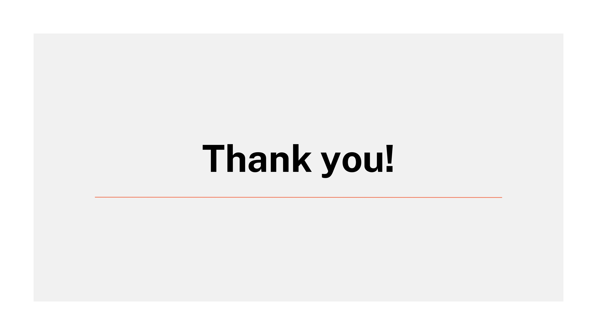


### Problem Statement

In the fast-paced taxi booking sector, making the most of

revenue is essential for long-term success and driver

happiness.

Our goal is to use data-driven insights to **maximise**

**revenue streams** for taxi drivers in order to meet this need.

Our research aims to determine whether payment

methods have an impact on fare pricing by focusing on the

relationship between payment type and fare amount..


# Research Question

###### Is there a relationship between total fare amount and payment type?

Can we nudge customers towards payment methods that generate higher revenue for drivers,
without negatively impacting customer experience?


For this analysis, we utilized the comprehensive dataset of NYC Taxi Trip records, used data
cleaning and feature engineering procedures to concentrate solely on the relevant columns
essential for our investigation.

```
passenger_count (1 to 5)
payment_type (card or cash)
fare_amount
trip_distance (miles)
duration (minutes)
```
#### Data Overview

###### Relevant columns used for this reseach:


```
Step Description
```
```
Descriptive Analysis Performed statistical analysis to summarize key aspects of the data, focusing on fareamounts and payment types.
```
```
Hypothesis Testing Conducted a T-test to evaluate the relationship between payment type and fareamount, testing the hypothesis that different payment methods influence fare
amounts.
```
```
Regression Analysis Implemented linear regression to explore the relationship between trip duration(calculated from pickup and dropoff times) and fare amount.
```
#### Methodology


```
Customers paying with cards tend to have a slightly higher average trip distance and fare amount
compared to those paying with cash.
```
```
Indicates that customers prefers to pay more with cards when they have high fare amount and
long trip distance.
```
##### Journey Insights

**Fare amount Trip Distance**

```
Payment
Type Mean
```
```
Standard
Deviation
```
```
Fare
amount Card 13.7 6.
```
```
Cash 12.25 6.
```
```
Trip
Distance Card 3.23 2.
```
```
Cash 2.8 2.
```

```
The proportion of customers paying with cards is
significantly higher than those paying with cash,
with card payments accounting for 67.5% of all
transactions compared to cash payments at
32.5%.
```
```
This indicates a strong preference among
customers for using card payments over cash,
potentially due to convenience, security, or
incentives offered for card transactions.
```
###### Card

###### Cash

###### Card

##### Preference of

##### Payment Types


##### Passenger Count Analysis

```
Among card payments, rides with a single passenger (passenger_count = 1) comprise the largest proportion,
constituting 40.08% of all card transactions.
Similarly, cash payments are predominantly associated with single-passenger rides, making up 20.04% of all
cash transactions.
There is a noticeable decrease in the percentage of transactions as the passenger count increases, suggesting
that larger groups are less likely to use taxis or may opt for alternative payment methods.
These insights emphasize the importance of considering both payment method and passenger count when
analyzing transaction data, as they provide valuable insights into customer behavior and preferences.
```

##### Hypothesis Testing

**Null hypothesis:** There is no difference in average fare between customers who use credit cards
and customers who use cash.

**Alternative hypothesis:** There is a difference in average fare between customers who use credit
cards and customers who use cash

With a T-statistic of 165.5 and a P-value of less than 0.05, we reject the null hypothesis, suggesting
that there is indeed a significant difference in average fare between the two payment methods.


#### Recommendations

```
Implement strategies such as offering incentives or discounts for credit card
transactions to incentivize customers to choose this payment method.
```
```
Provide seamless and secure credit card payment options to enhance customer
convenience and encourage adoption of this preferred payment method.
```
```
Encourage customers to pay with credit cards to capitalize on the potential for
generating more revenue for taxi cab drivers.
```

# Thank you!
